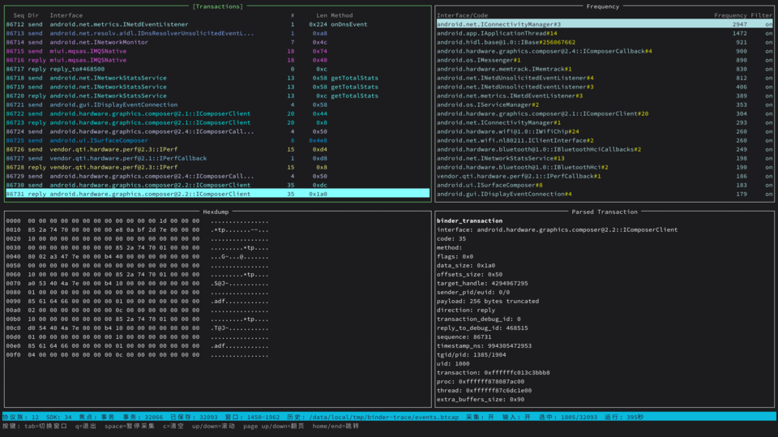

# binder-trace

Binder trace 工具工作区，用于研究和实现 Android Binder 调用观测、内核模块采集、事件解码、实时 TUI 和 JSONL 输出。

## 效果图

| TUI |
| --- |
| [](docs/assets/tui-demo.png) |

截图资源放在 `docs/assets/`；README 使用缩略图链接到原图，后续 Web UI 截图按同样方式追加。

## 目录结构

- `xtask/`: 本地任务和开发命令入口。
- `kernel/`: Android 内核模块、inline hook、符号解析和 DDK 构建脚本。
- `crates/bt-common/`: 内核侧和用户态共享的数据结构，保持小型、稳定、C-layout 友好。
- `crates/bt-agent/`: 用户态核心库，负责连接内核模块控制协议族和读取事件流。
- `crates/bt-decoder/`: raw Binder 事件流解码层，包含 Android 平台 Binder 方法表。
- `crates/bt-storage/`: JSONL 输出层，后续可扩展 SQLite。
- `crates/bt-cli/`: `binder-trace` 命令行入口和实时 TUI。
- `crates/bt-cli/src/tui/`: TUI 状态、输入、渲染、主题、文本宽度和 i18n 模块。
- `crates/bt-cli/src/tui/locales/`: TUI 文案 JSON 资源文件。

## 快速使用

只想使用成品时，不需要克隆仓库或拷贝脚本。先确认设备架构、内核版本和 root 权限:

```bash
adb shell getprop ro.product.cpu.abi
adb shell uname -r
adb shell su -c id
```

从 Release 下载两个文件:

- 用户态二进制: 选择和设备 ABI 匹配的 `binder-trace`，例如 `arm64-v8a` / `aarch64-linux-android`。
- 内核模块: 选择和设备 `uname -r` 或 Release 说明匹配的 `.ko` 文件。

下面命令假设下载后的本地文件名是 `binder-trace` 和 `bt-kmod.ko`:

```bash
adb shell mkdir -p /data/local/tmp/binder-trace
adb push binder-trace /data/local/tmp/binder-trace/binder-trace
adb push bt-kmod.ko /data/local/tmp/binder-trace/bt-kmod.ko
adb shell chmod 755 /data/local/tmp/binder-trace/binder-trace
```

加载内核模块:

```bash
adb shell su -c 'insmod /data/local/tmp/binder-trace/bt-kmod.ko'
```

如果设备上已经加载过旧模块，替换前先重启设备，再重新执行 `insmod`。当前模块不支持安全热卸载。

确认模块加载成功:

```bash
adb shell su -c 'lsmod | grep bt_kmod'
adb shell su -c "dmesg | grep -i 'binder-trace\|bt_kmod' | tail -30"
adb shell su -c '/data/local/tmp/binder-trace/binder-trace ipc feature'
```

启动 TUI 建议进入交互 shell，避免非交互 `adb shell su -c` 影响终端按键和尺寸:

```bash
adb shell
su
/data/local/tmp/binder-trace/binder-trace tui
```

## 从源码构建

开发者常用检查和本机运行命令:

```bash
cargo run -p xtask -- check
cargo run -p xtask -- run --output trace.jsonl
cargo run -p bt-cli --bin binder-trace -- --output trace.jsonl
cargo run -p bt-cli --bin binder-trace -- tui --help
```

构建 Android 用户态二进制并推送到设备:

```bash
export ANDROID_NDK_HOME=/path/to/android-ndk
android/push.sh
```

`android/push.sh` 默认使用 debug profile 构建 `aarch64-linux-android` 用户态二进制，并推送到 `/data/local/tmp/binder-trace/binder-trace`。需要调整构建或设备路径时可设置:

- `BINDER_TRACE_ANDROID_TARGET`
- `BINDER_TRACE_ANDROID_API`
- `BINDER_TRACE_PROFILE`
- `BINDER_TRACE_REMOTE_DIR`
- `BINDER_TRACE_BIN`
- `BINDER_TRACE_DEVICE_ID`

构建内核模块:

```bash
kernel/scripts/build-ddk.sh build android14-6.1
```

需要看 agent 自身调试日志时，通过 `RUST_LOG` 控制 stderr 输出:

```bash
RUST_LOG=bt_agent=debug android/run-root.sh tui
RUST_LOG=bt_agent=trace android/run-root.sh tui
```

## 实时 TUI

TUI 从内核模块事件流读取 `binder_transaction`，默认启用捕获配置并清空内核统计。界面分为四个窗格:

- `Transactions`: 展示 `Seq / Dir / Interface / # / Len / Method`，优先保证 `Interface` 可读，`Method` 在最右侧并允许截断。
- `Frequency`: 按 `interface + code` 聚合频次，支持对当前项开关过滤。
- `Hexdump`: 展示当前事件 payload。
- `Parsed Transaction`: 展示当前事件的解析字段和关联后的 reply 摘要。

常用启动参数:

```bash
/data/local/tmp/binder-trace/binder-trace tui --rows 1024 --refresh-ms 100
/data/local/tmp/binder-trace/binder-trace tui --tgid 12345
/data/local/tmp/binder-trace/binder-trace tui --uid 1000
/data/local/tmp/binder-trace/binder-trace tui --no-enable
/data/local/tmp/binder-trace/binder-trace tui --history-path /data/local/tmp/binder-trace/events.btcap
```

TUI 默认历史文件:

- Android 设备: `/data/local/tmp/binder-trace/events.btcap`
- 其他环境: `binder-trace.btcap`

历史文件是二进制 `btcap` 格式，TUI 会把事件写入 mmap 文件，并在向上滚动时从历史窗口回读旧事件。

## TUI 语言资源

TUI 状态栏和按键提示会检测系统语言:

1. Android: `persist.sys.locale`、`ro.product.locale`、`ro.product.locale.language`
2. 环境变量: `LC_ALL`、`LC_MESSAGES`、`LANGUAGE`、`LANG`

当前支持:

- English: `crates/bt-cli/src/tui/locales/en-US.json`
- 中文: `crates/bt-cli/src/tui/locales/zh-CN.json`
- 日本語: `crates/bt-cli/src/tui/locales/ja-JP.json`

资源通过 `include_bytes!` 编进二进制，并用 `serde_json` 解析。资源结构使用 `serde(deny_unknown_fields)` 校验；JSON 缺字段、字段名错误或格式无效时会直接 panic，测试会覆盖三份内置资源。

## 内核模块

内核模块构建脚本位于 `kernel/scripts/`，默认产物名为 `bt-kmod.ko`。常用命令:

```bash
kernel/scripts/build-ddk.sh build android14-6.1
kernel/scripts/build-ddk.sh clean android14-6.1
```

模块加载辅助脚本为:

```bash
kernel/scripts/insmod_ko.sh bt-kmod.ko
```

当前内核模块安装 Binder hook 后会禁止普通 `rmmod` 热卸载。原因是 `binder_ioctl` 可能长时间阻塞；在 hook 改为 tail-call 形式前，热卸载可能让阻塞线程返回到已卸载的模块文本段。需要替换模块时先重启测试设备。

## 输出格式

无子命令运行时，`binder-trace` 输出 JSONL 消息信封，方便后续写入消息队列。外层携带设备和路由信息，具体事件内容放在 `data` 下，避免把不同 source 的字段平铺混在一起。

程序启动后会先输出当前程序版本事件:

```json
{
  "device_id": "2957c54c",
  "seq": 0,
  "timestamp_ns": 123456789,
  "object": "program.version",
  "data": {
    "program": "binder-trace",
    "version": "0.1.0"
  }
}
```

后续采集或诊断事件继续使用同一个 `seq` 递增:

```json
{
  "device_id": "2957c54c",
  "seq": 1,
  "timestamp_ns": 123456789,
  "object": "agent.diagnostic",
  "data": {
    "kind": "diagnostic",
    "binder_device": "unknown",
    "process": { "pid": 123, "tid": 0, "uid": 0 },
    "flags": 0,
    "sequence": 0,
    "transaction": null
  }
}
```

内核模块事件 reader 接入后，采集事件会继续复用同一套消息信封，保证 `seq` 单调递增。

## 开发规范

项目文档和代码要求见 [`docs/development-guidelines.md`](docs/development-guidelines.md)。
