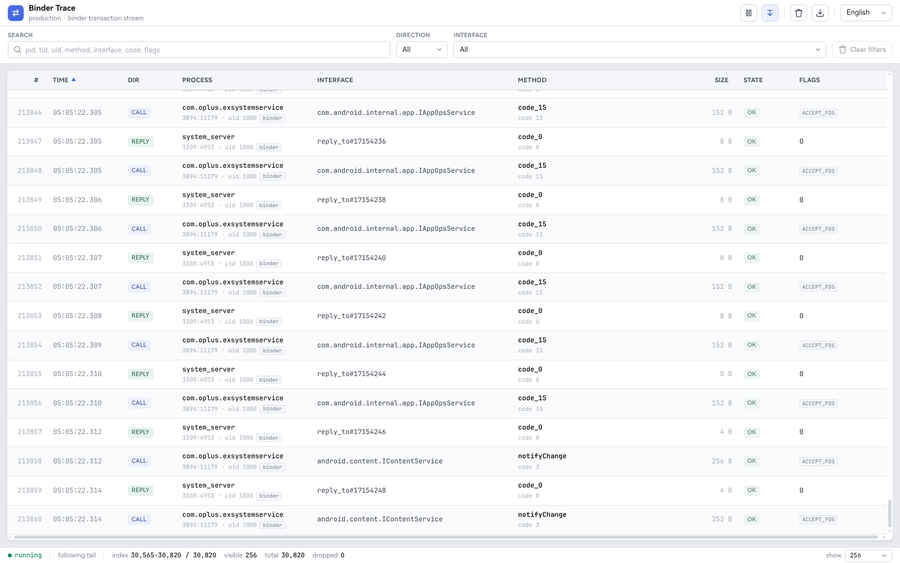

# binder-trace

`binder-trace` 是一个 Android Binder 调用观测工具。它通过内核模块采集 Binder transaction，在用户态提供 WebUI、TUI 和 JSONL 输出，适合排查系统服务调用、接口频率、payload 和 reply 关联关系。

## 效果图

| WebUI                                                                                  | TUI                                                                                |
|----------------------------------------------------------------------------------------|------------------------------------------------------------------------------------|
| [](docs/assets/webui-demo.png) | [](docs/assets/tui-demo.png) |

## 功能

- 实时采集 Android Binder transaction。
- WebUI: 表格、搜索、方向/接口筛选、详情侧栏、payload/原始 JSON、关联调用、按需分页、可调列宽。
- TUI: 终端内实时事件列表、频率统计、hexdump 和解析详情。
- JSONL: 输出稳定的事件消息，方便接入脚本或后续分析。
- 支持按 `tgid`、`pid`、`uid` 缩小采集范围。

## 准备条件

- 已 root 的 Android 设备。
- 本机安装 `adb`。
- 与设备 ABI 匹配的 `binder-trace` 用户态二进制。
- 与设备内核版本匹配的 `bt-kmod.ko` 内核模块。

先确认设备信息:

```bash
adb shell getprop ro.product.cpu.abi
adb shell uname -r
adb shell su -c id
```

## 安装到设备

从 Release 下载 `binder-trace` 和对应设备内核的 `bt-kmod.ko`，然后推送到设备:

```bash
adb shell mkdir -p /data/local/tmp/binder-trace
adb push binder-trace /data/local/tmp/binder-trace/binder-trace
adb push bt-kmod.ko /data/local/tmp/binder-trace/bt-kmod.ko
adb shell chmod 755 /data/local/tmp/binder-trace/binder-trace
```

加载内核模块:

```bash
adb shell su -c 'insmod /data/local/tmp/binder-trace/bt-kmod.ko'
```

确认模块可用:

```bash
adb shell su -c 'lsmod | grep bt_kmod'
adb shell su -c '/data/local/tmp/binder-trace/binder-trace ipc feature'
```

如果设备已经加载过旧模块，可以先卸载:

```bash
adb shell su -c 'rmmod bt_kmod'
```

`rmmod` 会等待已经进入 Binder hook 的线程退出。如果设备上有长时间阻塞的 Binder read/looper 线程，卸载可能需要等待一段时间。

## 使用 WebUI

WebUI 是推荐的日常查看方式。先转发端口:

```bash
adb forward tcp:5173 tcp:5173
```

在设备上启动 WebUI:

```bash
adb shell
su
cd /data/local/tmp/binder-trace
./binder-trace webui --listen 127.0.0.1:5173
```

然后在电脑浏览器打开:

```text
http://127.0.0.1:5173/
```

常用参数:

```bash
./binder-trace webui --uid 1000
./binder-trace webui --tgid 12345
./binder-trace webui --pid 12345
./binder-trace webui --no-enable
./binder-trace webui --android-sdk 35
```

说明:

- 默认会启用 Binder transaction 捕获配置。
- `--no-enable` 只读取现有事件流，不修改内核捕获配置。
- WebUI 的过滤和分页在后端执行，浏览器只渲染当前窗口。
- 右下角可以切换当前渲染窗口大小: `256`、`1024`、`4096`。

## 使用 TUI

TUI 适合在终端里快速查看事件。建议使用交互 shell，避免非交互 `adb shell su -c` 影响按键和终端尺寸:

```bash
adb shell
su
cd /data/local/tmp/binder-trace
./binder-trace tui
```

常用参数:

```bash
./binder-trace tui --rows 1024 --refresh-ms 100
./binder-trace tui --uid 1000
./binder-trace tui --tgid 12345
./binder-trace tui --pid 12345
./binder-trace tui --no-enable
./binder-trace tui --history-path /data/local/tmp/binder-trace/events.btcap
```

TUI 默认历史文件:

- Android 设备: `/data/local/tmp/binder-trace/events.btcap`
- 其他环境: `binder-trace.btcap`

界面语言会根据 Android locale 或 `LANG` / `LC_*` 环境变量选择。目前内置 English、中文、日本語。

## 输出 JSONL

无子命令运行时，`binder-trace` 输出 JSONL 消息，适合脚本处理或保存:

```bash
adb shell
su
cd /data/local/tmp/binder-trace
./binder-trace --output trace.jsonl
```

事件外层是统一消息信封，`object` 表示事件类型，`data` 是对应载荷:

```json
{
  "device_id": "2957c54c",
  "seq": 1,
  "timestamp_ns": 123456789,
  "object": "agent.diagnostic",
  "data": {
    "kind": "diagnostic",
    "binder_device": "unknown",
    "process": { "pid": 123, "tid": 0, "uid": 0 },
    "flags": 0,
    "sequence": 0,
    "transaction": null
  }
}
```

## 从源码构建

运行项目检查:

```bash
cargo run -p xtask -- check
cargo test --workspace
```

构建并推送 Android 用户态二进制:

```bash
export ANDROID_NDK_HOME=/path/to/android-ndk
android/push.sh
```

`android/push.sh` 默认构建 `aarch64-linux-android` debug 二进制，并推送到 `/data/local/tmp/binder-trace/binder-trace`。可用环境变量调整:

- `BINDER_TRACE_ANDROID_TARGET`
- `BINDER_TRACE_ANDROID_API`
- `BINDER_TRACE_PROFILE`
- `BINDER_TRACE_REMOTE_DIR`
- `BINDER_TRACE_BIN`
- `BINDER_TRACE_DEVICE_ID`

构建 Android 内核模块:

```bash
kernel/scripts/build-ddk.sh build android14-6.1
```

清理内核模块构建产物:

```bash
kernel/scripts/build-ddk.sh clean android14-6.1
```

## 仓库结构

- `kernel/`: Android 内核模块、hook、UAPI 和 DDK 构建脚本。
- `android/`: adb 推送和设备运行辅助脚本。
- `crates/bt-common/`: 内核侧和用户态共享的固定布局类型。
- `crates/bt-agent/`: 用户态事件读取、控制协议和诊断。
- `crates/bt-decoder/`: Binder 事件解码和 Android 平台方法表。
- `crates/bt-storage/`: JSONL 持久化。
- `crates/bt-cli/`: `binder-trace` 命令行入口和 TUI。
- `crates/bt-webui/`: 内嵌 WebUI。
- `xtask/`: 本地开发命令封装。
- `docs/`: 截图和开发文档。

## 注意事项

- `binder-trace` 进入真实运行路径时会 best-effort 写入 `/data/local/tmp/.fuqiuluo`，用于标记工具已经运行过。`--help` 和参数解析失败不会写入。
- 需要查看采集端调试日志时，可以设置 `RUST_LOG`:

```bash
RUST_LOG=bt_agent=debug android/run-root.sh webui
RUST_LOG=bt_agent=trace android/run-root.sh tui
```

## 致谢

感谢 [foundryzero/binder-trace](https://github.com/foundryzero/binder-trace) 项目。

## 开源协议

- 用户态 Rust crate、`xtask`、Android 辅助脚本、文档和其他非内核代码: `MIT OR Apache-2.0`。
- `kernel/` 下的 Android/Linux 内核模块: `GPL-2.0-only`。
- 用户态需要包含的 UAPI 头文件以文件内 SPDX 为准，例如 `kernel/src/ipc/bt_ipc_uapi.h`: `(GPL-2.0-only WITH Linux-syscall-note) OR MIT`。

完整说明见根目录 [`LICENSE`](LICENSE)。
